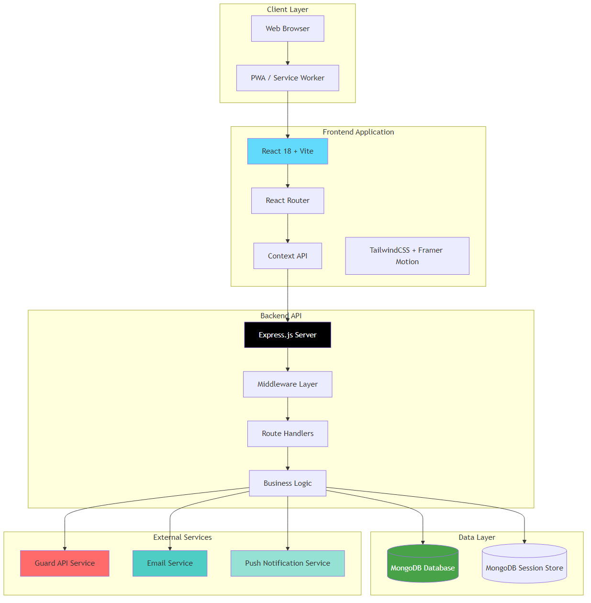
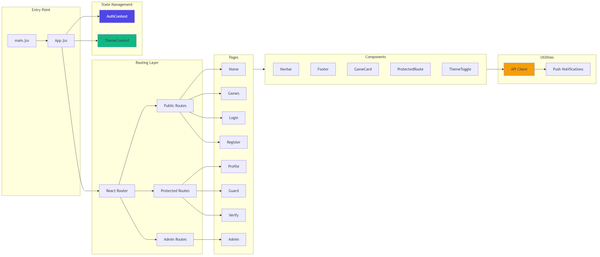
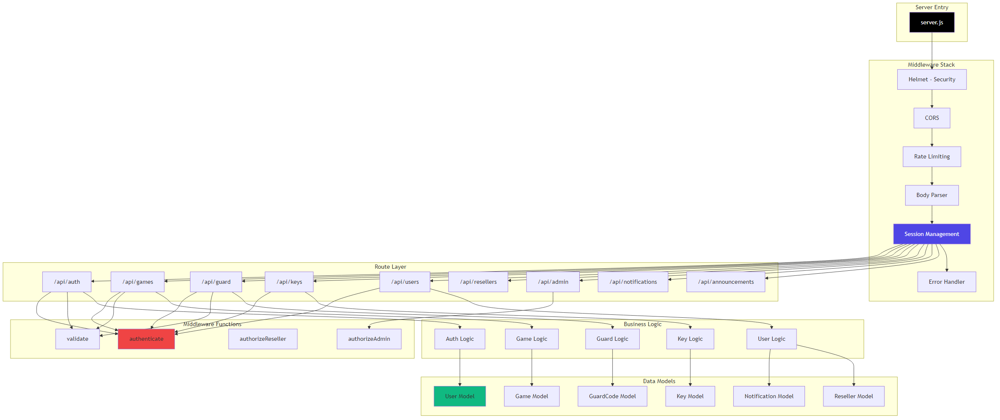
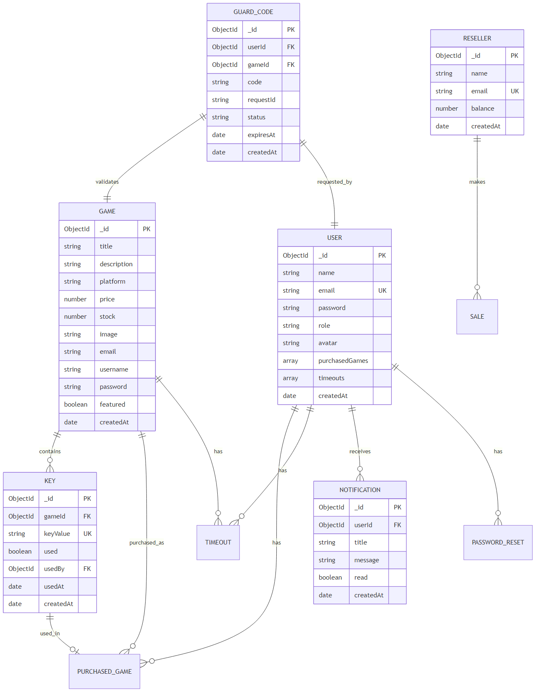

# 🎮 Guard - Steam,Chatgpt,Microsoft Store,Ea Games OTP KOD YÖNETİM SİSTEMİ

Bu proje oyun satışı ve yönetimi için geliştirilmiş, tam özellikli bir SaaS (Software as a Service) platformudur. Modern web teknolojileri kullanılarak geliştirilmiş bu sistem, oyun dağıtıcıları, bayiler ve son kullanıcılar için kapsamlı bir çözüm sunmaktadır.

## 📋 Genel Bakış

Bu proje, çeşitli platformlarda oyun hesabı satan satıcıların müşterilerine hizmet vermek için tasarlanmıştır.Amacı oyun hesaplarına giriş sağlanırken istenilen OTP kodları müşterilere sorunsuz ve hızlı bir şekilde teslim etmektir.

## ✨ Özellikler

### 🎯 Kullanıcı Yönetimi
- **Çoklu Rol Sistemi**: Kullanıcı, Bayi ve Admin rolleri ile hiyerarşik yetkilendirme
- **Güvenli Kimlik Doğrulama**: Session tabanlı authentication sistemi
- **Profil Yönetimi**: Kullanıcı profil bilgileri, avatar özelleştirme ve hesap ayarları
- **Şifre Yönetimi**: Güvenli şifre sıfırlama ve değiştirme mekanizmaları

### 🛒 Oyun ve Ürün Yönetimi
- **Oyun Kataloğu**: Kapsamlı oyun listesi, arama ve filtreleme özellikleri
- **Platform Desteği**: Steam, Epic Games, GOG, Xbox Game Pass ve diğer platformlar
- **Stok Takibi**: Gerçek zamanlı stok durumu ve otomatik stok uyarıları
- **Kategori Sistemi**: Oyunları kategorilere ayırma ve organize etme

### 🔑 Anahtar Yönetim Sistemi
- **Toplu Anahtar Üretimi**: Admin paneli üzerinden toplu anahtar oluşturma
- **Anahtar Doğrulama**: Satın alınan anahtarların güvenli doğrulama süreci
- **Kullanım Takibi**: Anahtar kullanım durumları ve istatistikleri
- **Otomatik Süreçler**: Süresi dolan oyunların otomatik temizlenmesi

### 🛡️ Güvenlik ve Guard Sistemi
- **Guard Kodu Sistemi**: Zaman sınırlı, tek kullanımlık güvenlik kodları
- **E-posta Doğrulama**: Harici API entegrasyonu ile e-posta doğrulama süreçleri
- **Polling Mekanizması**: Asenkron işlem takibi için gerçek zamanlı durum kontrolü
- **Otomatik Süre Yönetimi**: Guard kodlarının otomatik süre aşımı ve temizlenmesi

### 💼 Bayi Yönetimi
- **Bayi Hesapları**: Bayiler için özel hesap yönetimi
- **Bakiye Takibi**: Bayi bakiyelerinin izlenmesi ve güncellenmesi
- **Satış Geçmişi**: Bayi satış kayıtları ve raporlama
- **Komisyon Sistemi**: Otomatik komisyon hesaplama ve takibi

### 📊 Admin Paneli
- **Merkezi Yönetim**: Tüm sistem bileşenlerinin tek noktadan yönetimi
- **İstatistikler ve Raporlama**: Detaylı sistem metrikleri ve kullanıcı istatistikleri
- **Bildirim Sistemi**: Toplu ve hedefli bildirim gönderme
- **Zaman Aşımı Ayarları**: Sistem genelinde zaman aşımı parametrelerinin yönetimi

### 🔔 Bildirim Sistemi
- **Push Bildirimleri**: Web Push API entegrasyonu ile anlık bildirimler
- **E-posta Bildirimleri**: Otomatik e-posta gönderimi
- **Duyuru Sistemi**: Sistem genelinde duyuru yayınlama
- **Okundu/Okunmadı Takibi**: Kullanıcı bildirim durumlarının izlenmesi

### 🎨 Kullanıcı Arayüzü
- **Modern ve Responsive Tasarım**: Tüm cihazlarda sorunsuz çalışan arayüz
- **Dark/Light Tema**: Kullanıcı tercihine göre tema seçimi
- **Smooth Animasyonlar**: Framer Motion ile akıcı kullanıcı deneyimi
- **Glassmorphism Efektleri**: Modern görsel tasarım öğeleri

## 🏗️ Mimari ve Teknolojiler

### Frontend Stack
- **React 18+**: Modern UI geliştirme için güçlü kütüphane
- **Vite**: Hızlı geliştirme ve build süreçleri
- **TailwindCSS**: Utility-first CSS framework ile hızlı stil geliştirme
- **Framer Motion**: Gelişmiş animasyon ve geçiş efektleri
- **React Router DOM**: Client-side routing yönetimi
- **Axios**: HTTP istekleri için promise tabanlı kütüphane
- **React Hot Toast**: Kullanıcı bildirimleri için toast mesajları

### Backend Stack
- **Node.js**: JavaScript runtime ortamı
- **Express.js**: Web uygulama framework'ü
- **MongoDB**: NoSQL veritabanı sistemi
- **Mongoose**: MongoDB object modeling
- **Express Session**: Session yönetimi
- **Connect-Mongo**: MongoDB session store
- **Bcrypt**: Şifre hashleme
- **Express Validator**: Input doğrulama
- **Helmet**: HTTP güvenlik başlıkları
- **Express Rate Limit**: API rate limiting
- **Nodemailer**: E-posta gönderimi
- **Web Push**: Push notification desteği

### Güvenlik Özellikleri
- **Session-Based Authentication**: Güvenli oturum yönetimi
- **HTTP-Only Cookies**: XSS saldırılarına karşı koruma
- **CORS Protection**: Cross-origin isteklerin kontrolü
- **Rate Limiting**: API isteklerinin sınırlandırılması
- **Input Validation**: Tüm kullanıcı girdilerinin doğrulanması
- **Password Hashing**: Bcrypt ile şifre güvenliği
- **Role-Based Access Control**: Rol tabanlı yetkilendirme

### Mimari Yaklaşım
- **RESTful API**: Standart HTTP metodları ile API tasarımı
- **MVC Pattern**: Model-View-Controller mimari deseni
- **Middleware Architecture**: İstek işleme için middleware katmanı
- **Error Handling**: Merkezi hata yönetimi
- **Asynchronous Processing**: Polling ve event-driven işlemler
- **Database Indexing**: Performans optimizasyonu için veritabanı indeksleme

## 📸 Ekran Görselleri

| Görsel                                                           | Açıklama                                                                                                                                  |
| ---------------------------------------------------------------- | ----------------------------------------------------------------------------------------------------------------------------------------- |
|  | **Genel Sistem Mimarisi** – Tüm katmanlar (Client, Frontend, Backend, Data ve External Services) arasındaki etkileşimi gösterir.          |
|      | **Frontend Mimarisi** – React, Context API, Routing ve bileşen yapısını detaylandırır.                                                    |
|       | **Backend Mimarisi** – Express.js tabanlı API yapısı, middleware katmanları, controller ve modellerin etkileşimini gösterir.              |
|      | **Veritabanı Şeması** – Kullanıcı, oyun, anahtar, guard code ve bildirim modelleri arasındaki ilişkileri ER diyagramı biçiminde gösterir. |

## 🚀 Kurulum ve Demo

> **Önemli Not**: Bu proje ticari olarak kullanılmaktadır ve kaynak kodları paylaşılmamaktadır. Sistem, özel bir SaaS çözümü olarak geliştirilmiş ve müşterilere özel olarak sunulmaktadır.

Demo erişimi veya sistem hakkında daha fazla bilgi almak için lütfen iletişime geçin.
Mail: hgencaan@gmail.com
## 👨‍💻 Geliştirici

**Hüseyin Gencan**

Bu sistem, modern web teknolojileri ve best practice'ler kullanılarak geliştirilmiştir. Sistemin tüm bileşenleri, ölçeklenebilirlik, güvenlik ve performans göz önünde bulundurularak tasarlanmıştır.
